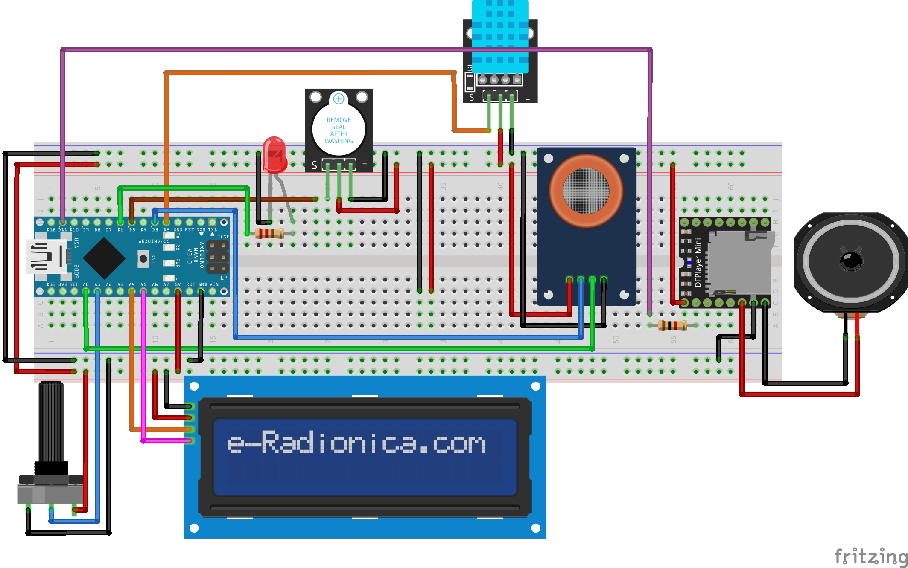

# Sistema de Monitoreo de Ambiente con DFPlayer Mini y Pantalla LCD - ARDUINO

Este proyecto utiliza un microcontrolador Arduino para monitorear la calidad del aire, la temperatura y la humedad, mientras controla la reproducción de audio a través de un módulo **DFPlayer Mini MP3**. La interfaz de usuario se realiza mediante una pantalla **LCD I2C**, con funciones adicionales como alertas y controles de volumen.  

---

## Diagrama

  

---

## Funcionalidades  
- **Reproducción de audio con DFPlayer Mini:**  
  - Reproducción basada en la temperatura ambiente.  
  - Modos de reproducción:  
    - **Automático:** Cambia el audio cuando la temperatura varía.  
    - **Temporizado:** Reproduce cada intervalo configurado.  
    - **Manual:** Sin reproducción automática.  
- **Monitoreo de temperatura y humedad:**  
  - Sensores **DHT11** y visualización en pantalla.  
  - Alertas visuales en caso de error del sensor.  
- **Monitoreo de calidad del aire:**  
  - Sensor **MQ135** en modos digital y analógico.  
  - Alerta sonora y visual cuando la calidad del aire es peligrosa.  
- **Control de volumen:**  
  - Ajuste mediante potenciómetro.  
  - Indicador gráfico del nivel en la pantalla LCD.  
- **Pantalla LCD personalizada:**  
  - Visualización de información ambiental.  
  - Indicadores de estado y volumen.  

---

## Componentes Utilizados  
### Hardware  
- **Microcontrolador:** Arduino Uno/Nano  
- **Módulo MP3:** DFPlayer Mini  
- **Pantalla LCD:** LiquidCrystal_I2C (16x2)  
- **Sensor de temperatura y humedad:** DHT11  
- **Sensor de calidad del aire:** MQ135  
- **Módulo de sonido:** Buzzer piezoeléctrico max. 4 watts.
- **Potenciómetro 10kohm:** Para ajuste de volumen  
- **Pulsador:** Para cambiar modos de operación  
- Resistencia 10k para el DFPlayer
- Diodo led + resistencia 220 ohm

### Librerias
- Librerías necesarias:  
  - `DFRobotDFPlayerMini`  
  - `LiquidCrystal_I2C`  
  - `DHT Sensor Library`

---

## Modos de Operación  
1. **Manual:** Reproducción desactivada.  
2. **Automático:** Reproduce audio al detectar cambios en la temperatura.  
3. **Temporizado:** Reproduce audio a intervalos configurables (1, 5, 15, 30, 60 minutos).  

---

## Consideraciones  
- Asegúrate de insertar una tarjeta SD con los archivos de audio en el módulo DFPlayer Mini.  
- Verifica las conexiones y el direccionamiento I2C de la pantalla LCD antes de cargar el código.  
- Los niveles de calidad del aire se configuran según las características del sensor MQ135.  
